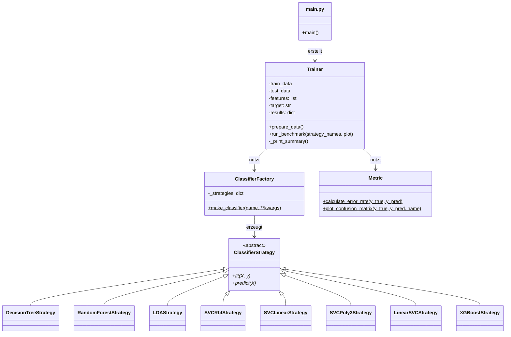
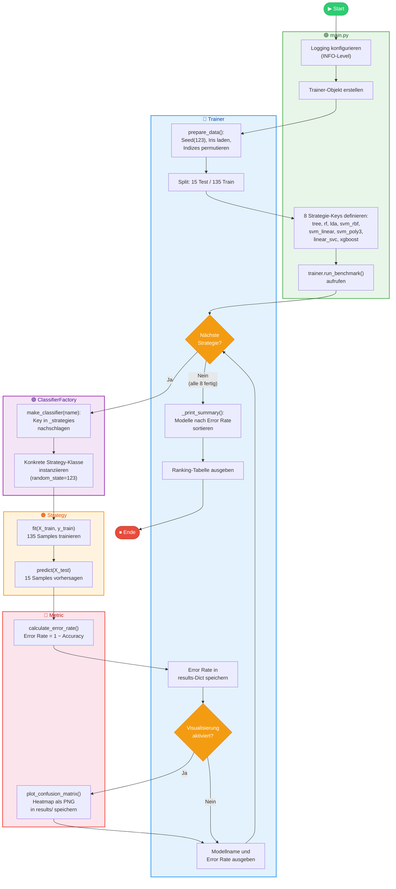
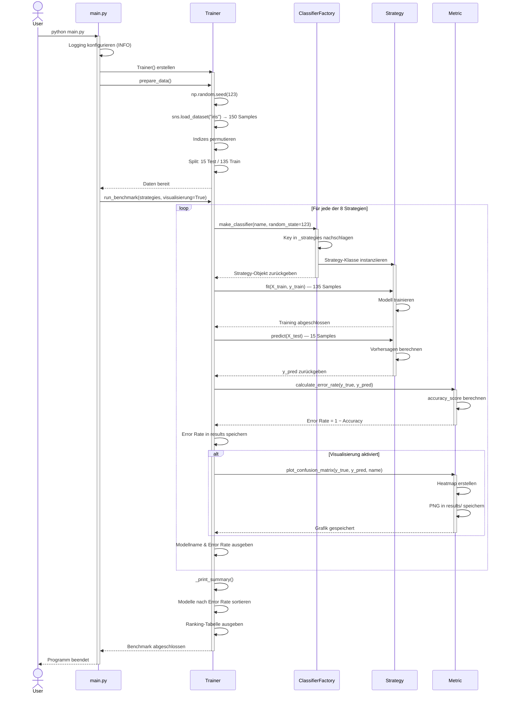

# ML-Klassifikations-Benchmark – Projektablauf & Aktivitätsdiagramm

## Projektübersicht

Das Projekt vergleicht **8 ML-Klassifikationsmodelle** anhand des **Iris-Datensatzes** (150 Samples). Es nutzt die Design Patterns **Strategy** und **Factory**, um Modelle austauschbar und erweiterbar zu halten.

## Architektur (Klassenstruktur)

## Detaillierter Ablauf (Schritt für Schritt)

### 1. Programmstart – `main.py`
- Logging wird konfiguriert (`INFO`-Level)
- Ein `Trainer`-Objekt wird erstellt (leere Datenfelder, Feature-/Target-Namen definiert)

### 2. Datenvorbereitung – `Trainer.prepare_data()`
- **Seed setzen**: `np.random.seed(123)` für Reproduzierbarkeit
- **Iris-Datensatz laden**: via `seaborn.load_dataset('iris')` (150 Samples, 4 Features, 3 Klassen)
- **Zufällige Permutation** der 150 Indizes
- **Split**: Die ersten **15 Indizes → Testdaten**, die restlichen **135 → Trainingsdaten**

### 3. Benchmark-Schleife – `Trainer.run_benchmark()`
Für **jedes der 8 Modelle** (`tree`, `rf`, `lda`, `svm_rbf`, `svm_linear`, `svm_poly3`, `linear_svc`, `xgboost`) wird folgender Zyklus durchlaufen:

| Schritt | Was passiert | Modul |
|---------|-------------|-------|
| **3a** | `ClassifierFactory.make_classifier(name)` – Sucht den Key im `_strategies`-Dict und instanziiert die konkrete Strategy-Klasse mit `random_state=123` | `factory.py` |
| **3b** | `strategy.fit(X_train, y_train)` – Trainiert das Modell auf den 135 Trainingsdaten | `strategies.py` |
| **3c** | `strategy.predict(X_test)` – Erzeugt Vorhersagen für die 15 Testdaten | `strategies.py` |
| **3d** | `Metric.calculate_error_rate(y_true, y_pred)` – Berechnet `1 - accuracy_score` | `metrics.py` |
| **3e** | `Metric.plot_confusion_matrix(...)` – Erstellt und speichert Confusion-Matrix-Heatmap als PNG in `results/` | `metrics.py` |
| **3f** | Error Rate wird in `self.results[name]` gespeichert | `trainer.py` |

### 4. Zusammenfassung – `Trainer._print_summary()`
- Sortiert alle 8 Modelle nach Error Rate (aufsteigend)
- Gibt ein Ranking mit Rang, Modellname, Error Rate und Accuracy aus

### Besonderheiten einzelner Strategien
- **LDA**: Entfernt `random_state` aus `kwargs`, da `LinearDiscriminantAnalysis` diesen Parameter nicht unterstützt
- **XGBoost**: Nutzt einen `LabelEncoder`, um String-Labels in numerische Werte zu konvertieren (und bei `predict` wieder zurück)
- **Alle Strategien**: Nutzen den `@log_method`-Decorator, der Klassenname, Methodenname und Anzahl der Samples loggt

---

## Aktivitätsdiagramm (mit Swimlanes)

Jede Swimlane zeigt die **zuständige Komponente** für den jeweiligen Schritt.

---

## Sequenzdiagramm

Zeigt die **zeitliche Abfolge der Aufrufe** zwischen den Komponenten.

---

## Dateiübersicht

| Datei | Rolle | Zeilen |
|-------|-------|--------|
| [main.py](file:///c:/Code/AUGSBURG_10237747_Python_Simon/main.py) | Einstiegspunkt, definiert Strategie-Liste, startet Benchmark | 42 |
| [trainer.py](file:///c:/Code/AUGSBURG_10237747_Python_Simon/src/trainer.py) | Orchestrierung: Daten laden, split, Schleife über Modelle, Zusammenfassung | 63 |
| [factory.py](file:///c:/Code/AUGSBURG_10237747_Python_Simon/src/factory.py) | Factory Pattern: String-Key → konkretes Strategy-Objekt | 45 |
| [interfaces.py](file:///c:/Code/AUGSBURG_10237747_Python_Simon/src/interfaces.py) | Abstrakte Basisklasse `ClassifierStrategy` + `@log_method` Decorator | 26 |
| [strategies.py](file:///c:/Code/AUGSBURG_10237747_Python_Simon/src/strategies.py) | 8 konkrete Strategy-Implementierungen | 117 |
| [metrics.py](file:///c:/Code/AUGSBURG_10237747_Python_Simon/src/metrics.py) | Error Rate berechnen + Confusion-Matrix-Heatmap speichern | 29 |
